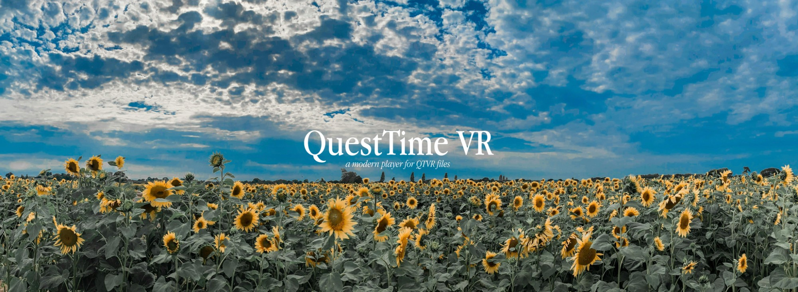

# QuestTime VR — the long version

A sideloadable Quest 3 app that opens QuickTime VR files and puts you inside them.

Everything needed to build lives in this folder. Nothing is installed system-wide,
nothing is assumed to be on `PATH`, and deleting this directory removes all of it.

```
QuestTimeVR/
  build.sh            one-command build
  toolchain/          JDK 17, Gradle 8.9, Android SDK 34, NDK 30, CMake  (~3.9 GB, not in the repo)
  reference/          Python reference decoder + desktop tools
  android/            the app
```

Everything about how this works, what it can and cannot open, and why it is built the
way it is. The [README](../README.md) is the short version.

## What this is, in plain terms

QuickTime VR was Apple's mid-1990s format for standing inside a photograph. You shot
a ring of overlapping pictures from one spot, stitched them into a single long strip,
and saved it as a `.mov` file. Apple's viewer let you drag a mouse around a small
window to look about. It was the closest thing to virtual reality that a 1995 desktop
could manage.

The current version of QuickTime is unable to preview these files, and the panoramas
inside them — a lot of them the only surviving record of a place at a moment — became
effectively unopenable.

The odd thing is that the format was always describing a shape you can now simply
*stand in*. A QuickTime VR panorama is a cylinder: pixels wrapped around you, with a
number saying how far round it goes and another saying how tall it stands. A Quest
draws cylinders natively. So this app does not really convert anything, it reads what
the file already says and hands it to the headset in those terms.

### What happens when you open a file

1. **Read the container.** A `.mov` file is a tree of labelled boxes. One of them
   holds a panorama descriptor: where the sweep starts and ends, how tall it is, and
   how the image was cut up. Two eras of the format put it in two different places,
   so the app looks in both.
2. **Decode the picture.** The file's "video track" is not motion. It is one still
   image sliced into vertical strips — 24 of them in a 1995 file, 96 in a later one —
   because a 1995 machine could not hold a whole panorama in memory at once.
3. **Reassemble it.** Stack the strips into one tall column and rotate it a quarter
   turn. QuickTime VR stored panoramas lying on their side, so that the old decoder
   could stream them a column at a time.
4. **Extend the sky and floor.** A photographic panorama is a band; it stops before
   the top and bottom of the world. Rather than leave you in a black tube, the app
   continues each edge outward in a soft gradient sampled from the picture's own
   colours, so the room dissolves into its own light instead of ending on a line.
5. **Hand it to the headset.** The image is uploaded once and given to the Quest's
   compositor as a cylinder — or, for the later cubic files, as a cube.

That last step is the whole idea, and it is why this looks better than it has any
right to. **Nothing is reprojected.** Most panorama viewers convert the image into
some other projection, wrap it on a sphere they have built themselves, and re-render
it every frame through their own camera. Every one of those steps resamples the
picture and loses a little of it. Here the image is never resampled at all. It goes to
the compositor in the projection it was already stored in, and the headset draws it at
full display resolution, at the display's own refresh rate, with the app doing nothing
per frame. There are no shaders, no 3D models and no camera in this app. A 1995
photograph reaches your eye about as directly as it can.

### What it is built with

| | |
|---|---|
| **OpenXR** | The headset-facing standard. The app asks for a *composition layer* — a cylinder or a cube — and the Quest's own compositor draws it. This is where the no-reprojection property comes from. |
| **Kotlin** | Reads the QuickTime container and decodes Cinepak, the 1990s codec the oldest files use, by hand. No library was available that could be trusted with it, so it was written from the format up and checked exhaustively. |
| **Android's image decoder** | Later files store their tiles as ordinary JPEG, so the system decoder handles those. |
| **A little C++ and OpenGL ES** | Only enough to satisfy OpenXR's setup requirements and copy the finished image into video memory once. It draws nothing. |
| **ffmpeg** | Not in the app. It is used during development as an independent second opinion: the decoder's output is compared against ffmpeg's, and the tests fail unless every colour channel of every pixel matches exactly. |
| **Python** | Also not in the app. A desktop version of the decoder, and a small tool that reproduces how a headset samples a cube, used to settle questions on a laptop instead of by trial and error in a headset. |

### What it will and will not open

It opens the three kinds of QuickTime VR panorama: the original cylindrical files,
their later higher-resolution successors, and the six-sided cubic ones that came with
QuickTime 5.

It refuses, with a plain message saying why, anything it cannot read correctly —
object movies, which are a different thing entirely; scenes holding several linked
panoramas; a rare storage variant that would come out lying on its side; and a handful
of rarer 1990s codecs. [Format coverage](#format-coverage) has the full list.

That refusal is deliberate. A decoder written without a way to check it produces
images that look plausible and are quietly wrong, which for a photographic record is
worse than not opening the file at all.

## Try it without building

Grab the APK from [Releases](../../releases) and sideload it. Building from source
needs a 3.9 GB toolchain; this does not.

With the Quest connected by USB and developer mode on:

```bash
adb install -r QuestTimeVR-0.1.0.apk
```

No adb? [SideQuest](https://sidequestvr.com) does the same thing with a button.
The app then appears in the Quest library under **Unknown Sources**.

The release APK is signed with the standard Android debug key, which is normal for a
sideloaded app and is why your headset will call it an unknown source. It contains no
panoramas and no music - those are not mine to ship - so it starts empty and tells you
how to send it something.

## Build

```bash
./build.sh
```

Output: `android/app/build/outputs/apk/debug/app-debug.apk` (~10.5 MB, arm64-v8a,
signed with the standard Android debug key). No sample panoramas and no music ship
with this repository, so that figure is what a fresh clone produces.

Other targets pass straight through to Gradle:

```bash
./build.sh testDebugUnitTest
./build.sh assembleRelease
```

Install it:

```bash
toolchain/android-sdk/platform-tools/adb install -r android/app/build/outputs/apk/debug/app-debug.apk
```

## Getting files onto the headset

Launch **QuestTime VR** from the Quest library. The first time, you stand inside a
welcome panorama with an address like `http://192.168.1.42:8080` on the wall around
you — yours will differ. After that it sits at the top of the list (**A** or **X**).

**Open that in a browser on the same Wi-Fi and drop files on the page.** That is the
whole procedure — no cable, no terminal, no package names. The page also lists what is
already on the headset.

This exists because the alternative is worse than it sounds. Android 11+ blocks MTP
writes to an app's own folder, so before this the only reliable route was `adb push`.

**It is an open server while the app is running.** No password, no pairing: anyone on
the same network who finds the address can list what is on the headset and send it
more files. They cannot make it run anything — uploads are checked, and the only thing
the app ever does with a file is try to decode it as a panorama — but on a network you
do not trust, close the app when you are not using it.

Every upload is checked before it is stored, and anything that will not open is
refused with a reason rather than kept:

| what you sent | what the page says |
|---|---|
| a panorama it can open | `QuickTime VR 1.0 cylindrical, 3000x768, cvid` |
| a classic Mac file | `Classic Mac file, header missing` — see below |
| an object movie | `an object you spin, not a panorama you stand inside` |
| a multi-node scene | `Multi-node scenes need node selection, which does not exist yet` |

Files with no extension — common, because classic Mac files carried type codes
instead — are saved with `.mov` appended so the picker can see them.

### Classic Mac files, and why half an archive looks broken

Mac QuickTime files of this era often keep only the media in the data fork and the
movie header in the **resource fork**, as resource `'moov'` #128. Nothing outside
macOS can see a resource fork — `adb push` drops it silently, and no browser upload
can carry it — so such a file arrives headerless and reads as "not a QuickTime file".

Of 27 files in one real archive, 13 were like this — nearly half a library failing
for a reason that has nothing to do with the files.

**Send them in a zip and this is handled for you.** Select them in Finder,
right-click, Compress, and drop the archive on the page: Finder stores each resource
fork as an AppleDouble sidecar inside the archive, and the app puts it back on
arrival. It has to be Finder's Compress (or `ditto`) — the `zip` command drops
resource forks, so an archive made that way is no better than sending the files loose.

To do it yourself instead, or to see what is in an archive before sending it:

```bash
reference/flatten.py -o /tmp/flat "Imports/"*
reference/applezip.py -o /tmp/flat archive.zip   # the same, from a Mac zip
reference/panotype.py /tmp/flat/*.mov            # what each one is, without decoding
```

Flattening appends the moov resource to a copy of the data fork. No offsets need
rewriting, because a dual-fork movie's chunk offsets already address the data fork
from its start.

### Without a browser

```bash
adb push panorama.mov /sdcard/Android/data/com.questtime.vr/files/
```

The app also searches `/sdcard/QuestTimeVR/`, `/sdcard/Download/` and
`/sdcard/Movies/`, but those need "All files access" — the app asks once, on its very
first launch, and "no" is fine: files sent from the browser never need it.
The app's own folder needs no permission at all.

## Using it

**Picking a file.** **A** or **X** opens the list in the headset; the thumbstick moves
through it and the trigger chooses. A multi-node scene opens its places instead. There
is no flat 2D screen — the app is immersive from the moment it launches. **Re-Scan
Files** picks up anything just sent from the browser.

**Turning.** Flick either thumbstick left or right to snap the view 45°. Snap rather
than smooth on purpose: a panorama gives the inner ear nothing to agree with, and
continuous rotation against a fixed image is what makes people queasy. The stick has
to return to centre before it will turn again, so a resting thumb does not spin the
world. Controllers are entirely optional — the app works without any input.

**Background music.** The browser page has a section for it. Send any audio file and
it becomes the ambient track; each panorama drops into it at a random point and fades
in, so the same place rarely opens on the same passage twice.

A mix of roughly 30 minutes to an hour suits this best. The random drop-in makes a
short loop give itself away within a couple of panoramas, and the page will say so if
what you sent is under twenty minutes.

**No music ships with this repository** — it would be someone else's. On a fresh
clone the page says so plainly and the app runs silent until you send one. If you
would rather bake one in, drop it at `android/app/src/main/res/raw/ambience.mp3`; the
app looks it up by name, so its absence is silence rather than a build failure.

## How it works

The interesting decision is that **nothing is reprojected**. QuickTime VR stores a
panorama in one of two shapes, and the Quest's compositor can draw both of them
directly. So the image is handed over in the projection it was already stored in —
no equirectangular conversion, no resampling, no invented poles, and no shaders,
meshes or view matrices anywhere in the app.

| Source | Layer submitted |
|---|---|
| cylindrical (QTVR 1.0 and 2.x) | `XR_KHR_composition_layer_cylinder`, as four 90° arcs |
| cubic (QTVR 2.x / QuickTime 5) | `XR_KHR_composition_layer_cube`, a real cubemap swapchain |

`vr_renderer.cpp` contains just enough EGL to satisfy OpenXR's graphics binding, then
submits layers. Neither path draws anything per frame.

### Cylindrical panoramas

A cylinder layer *is* a cylindrical projection, which is exactly what the format
stores, so the entire geometry contract is two numbers:

| | |
|---|---|
| `centralAngle` | horizontal sweep in radians, from `hPanStart`/`hPanEnd` |
| `aspectRatio`  | the panorama's pixel width / height |

The runtime derives the vertical extent as `atan(centralAngle / (2 * aspectRatio))`.

Several details are runtime-specific rather than fundamental, and each cost real time
to find:

- `centralAngle` is valid over a half-open `[0, 2π)`, so a full turn passed as exactly
  2π is out of range and draws nothing while reporting success. It is clamped only
  when a single arc carries the whole turn — the limit applies per layer, and with
  four arcs none of them is near 2π.
- One near-360° arc blanks half the cylinder depending on which way you face the seam.
  Hence four arcs, each pointing at its own slice of the texture. Splitting costs no
  quality: each arc samples its own columns, and scaling `centralAngle` and
  `aspectRatio` together leaves the horizon exactly where it was.
- `radius = 0` means an infinite cylinder in the specification and renders nothing
  here. A finite 500 m is used instead, which is far enough to be effectively at
  infinity — no parallax as you lean — and radius cancels out of the angular geometry
  anyway.

A cylinder reaches ±90° only in the limit, so there is always an open disc at each
pole. Two quad layers plug them, submitted *before* the arcs: composition layers
composite in submission order rather than by depth, so the arcs paint over the caps
and each cap shows only through its hole.

### Cubic panoramas

Six square faces go into a genuine cubemap swapchain (`faceCount = 6`) and are drawn
by one cube layer. This is the path that can see straight up and straight down, since
a cube has no poles to run out of.

Two conventions have to be got right, and both are settled in `Qtvr.toGlOrder` rather
than in the renderer, so they can be reasoned about and tested without a headset:

- QuickTime VR stores faces front, right, back, left, top, bottom; OpenGL wants
  +X, −X, +Y, −Y, +Z, −Z, and in OpenXR's axes forward is −Z.
- **GL's cubemap convention is left-handed.** For the −Z face it derives `s` from
  `−x`, so world-right lands at image-left and every side face comes out mirrored
  unless it is flipped horizontally first.

Cube faces also upload as stored, with no vertical flip — the opposite of the 2D
texture path, where row 0 is the *bottom* row.

Cubic files carry a second video track for the hot-spot mask, at the same dimensions
and sample count as the image. The image track is chosen by codec, never by order.

### Filling what was never photographed

Neither shape arrives complete. A cylindrical panorama is a band that stops short of
the zenith and nadir; a cubic one converted from a cylindrical original has its
capture edge cutting diagonally across the faces.

Both are filled with a gradient drawn from the picture's own edge colours, low-passed
around the full turn so it reads as the room's light continuing rather than as
vertical streaks, and blended toward a single mean at the poles. The cylindrical fill
works by adding rows — a cylinder layer covers more angle simply by having more of
them, and not one original pixel moves. The cubic fill works **by angle rather than
per face**: any direction outside the captured tilt range gets the gradient, whichever
face it lands on, which makes the fill continuous across face boundaries by
construction.

### A note on `vPanTop` / `vPanBottom`

The descriptor in the 1995 sample file claims ±42.5°, but the pixels disagree: a
2496 px circumference is a radius of 2496/2π = 397.2 px, and a half-height of 384 px
against that radius is ±44.03°. The two are inconsistent by about 3.5%. The chapel
file's agree exactly.

The app therefore takes its vertical extent from the pixel geometry and treats
`vPan*` as viewing limits rather than image extent. This is not a preference — the
aspect ratio is what actually has to line up for the image not to be stretched.

### Pipeline

Shared up to the point where the two shapes diverge:

1. Parse the QuickTime atom tree and find the panorama descriptor. QTVR 1.0 keeps it
   in the `pano` sample *description* as 16.16 fixed point; 2.x moved it into the pano
   track's *sample*, wrapped in an atom container (`sean` → `pdat`) with Float32
   angles. The 1.0 track is found by `format == "pano"`, the 2.x one by
   `handler == "pano"`.
2. Pick the image track by codec — cubic files have two video tracks of identical
   size, so order tells you nothing.
3. Decode its samples. They are not motion; they are one still image cut into pieces.

Cylindrical, from there:

4. Stack the slices into a single column (768 × 2496 for the 1995 file).
5. Rotate 90° clockwise, undoing the sideways storage the 1990s decoder needed.
   Whether this rotation applies is read from the descriptor rather than assumed —
   see [Format coverage](#format-coverage).
6. Downscale if wider than the swapchain limit, uniformly, so every angle survives.
7. Extend vertically with the gradient, then submit as four arcs plus two pole caps.

Cubic, from there:

4. Take the six faces, permute them into OpenGL's order and mirror each horizontally.
5. Fill by angle wherever the capture ran out.
6. Upload into a cubemap swapchain and submit one cube layer.

## What's verified

**On a real Quest 3** (API 34), full path — launch the app, choose a file, land in the
panorama:

```
layer: centralAngle=6.283185 aspect=1.8146 radius=500.00 arcs=4 perArc=1.570796 bleed=0.0800deg
session started
frames=720 rendered=720 (cylinder layer, +/-59.99 deg vertical)
```

Every submitted frame rendered, no dropped frames, no XR errors, steady 72 Hz.

Also confirmed on device: browser uploads and their verdicts, the music swap across
all three of its states, folder browsing, switching between panoramas while one is
open, and thumbstick turning.

**On this machine, with no device — 34 tests, all passing:**

- `Cinepak.kt` decodes **byte-for-byte identically to ffmpeg** — all 5,750,784
  channels of the sample file, zero mismatches.
  `DecoderTest.cinepakMatchesFfmpegExactly` runs on the JVM, diffing against
  ffmpeg's own output.
- The 2.x pipeline reproduces ffmpeg byte for byte as well, with the JPEG codec
  factored out at the decoder seam — so container parsing, assembly and rotation have
  nothing to hide behind.
- Container parsing, the `pano` descriptor, the rotation, the cylinder geometry math,
  cubic detection, the gradient fill, the picker's file listing, and the compatibility
  checker the upload page reports with.

The samples and the ffmpeg ground truth are not in this repository — see
`reference/README.md`. Without them the tests **skip** rather than fail, so a fresh
clone can report a green build having checked almost nothing; the test task warns
loudly whenever anything was skipped.

### Horizon OS launch interception

Worth knowing if you fork this. The first on-device launch never started the process
at all; `am start` silently redirected to a system dialog:

```
ActivityLaunchInterceptorController: RequiresControllersLaunchInterceptor:
  com.questtime.vr/.VrActivity -> com.oculus.vrshell/...LaunchCheckControllerRequiredDialogActivity
```

Horizon OS assumes an app needs controllers unless it declares hand-tracking support,
and puts up a "turn on your controllers" dialog first. Turning is optional here and
nothing else needs input, so declaring hand tracking as *not required* is both
accurate and the fix:

```xml
<uses-feature android:name="oculus.software.handtracking" android:required="false" />
<uses-permission android:name="com.oculus.permission.HAND_TRACKING" />
```

## Format coverage

QuickTime VR has more shapes than "a panorama in a `.mov`". This is what exists, per
Apple's *Inside QuickTime VR*, and what this app does with each.

### Node types

| | |
|---|---|
| **Panorama node** — you stand in a place | supported, both geometries below |
| **Object node** (`obje` / `obji`) — you orbit a thing | detected, refused |

Object movies are a genuinely different format that happens to share a container:
a grid of photographs of an object from many angles, not a scene with an inside.
They are identified by *handler*, not sample format — the obvious `'obji'` format
check matches no real file.

### Panorama geometry and storage (`panoType`)

QuickTime 5 added a field saying both what shape the panorama is and which way up it
was stored. Older files leave it blank and put the orientation in the low bit of
`flags` instead.

| `panoType` | meaning | status |
|---|---|---|
| blank, `flags` bit clear | cylinder, stored rotated 90° CCW | **supported** — both cylindrical samples are this |
| `'vcyl'` | cylinder, stored rotated | **supported** — same path, stated explicitly |
| `'cube'` | six cube faces | **supported** |
| `'hcyl'` | cylinder, stored **upright** | **detected, refused** |
| blank, `flags` bit set | cylinder, stored upright | **detected, refused** |

The last two are the honest gap. Every panorama before QuickTime 5 was stored on its
side, so the app rotated unconditionally — correct for both sample files, and correct
by luck rather than by checking. QuickTime 5 dropped that requirement, and an upright
file put through an unconditional rotation renders lying on its side without any error.
The descriptor is now read, and such a file refused.

Refused rather than handled, because **no panorama stored upright could be found**.
Nine files were examined across three archives, 1995 to 2007 — the ffmpeg sample
archive, panoramas.dk, and the two originals here. Every cylindrical one uses the
legacy blank-`panoType`, rotated form; every cubic one sets the flags bit as Apple
documents. `'hcyl'` appears in the specification and, so far, nowhere else.

The refusal itself is tested on a real file: `Qtvr2Test.refusesAPanoramaStoredUpright`
takes the chapel and flips the single bit that distinguishes the two, then checks the
untouched file still goes through. That tests the app's reading of the descriptor —
not what a real `'hcyl'` file's pixels look like, which is exactly why it refuses
instead of rotating. Reproduce the survey with `reference/fetch_wild.sh` and
`reference/panotype.py`.

### Scene structure

| | |
|---|---|
| Single-node | supported |
| Multi-node scene | detected, refused |

A multi-node movie holds several linked panoramas in one file, one sample per node in
the `pano` track. Taking node one's descriptor and then decoding every sample in the
image track stacks all the nodes into one very tall column — something that looks like
a panorama and is not one. Refused until node selection exists.

### Codecs

| | |
|---|---|
| Cinepak (`cvid`) | supported — decoded in Kotlin, byte-exact against ffmpeg |
| Photo-JPEG (`jpeg`, `mjpa`) | supported — via the system decoder on device |
| Apple Graphics (`smc`) | not decoded; recognised as the hot-spot mask and skipped |
| Sorenson, `rpza`, `rle`, raw, anything else | refused by name |

Those older codecs were left out rather than written blind. The codec seam in
`Qtvr.extract` is where libavcodec would slot in to cover them.

### Not implemented

- **Object movies.** A file you orbit rather than stand in — a grid of photographs of
  a thing from many angles. Detected by handler and refused, and a scene that mixes
  the two keeps its panorama nodes: Joshua Tree is 25 panoramas and 2 objects, and
  the blanket "there is an `obje` track, so refuse" check once threw away all 25.
- **Upright-stored cylinders.** Detected and refused. Every cylindrical file found in
  the wild, across three archives and twelve years, is the legacy rotated form, so
  there is nothing to test a fix against.
- **Node names in 2.x.** 2.x keeps no name beside a node the way 1.0's `strT` does,
  so those scenes list by position. The readable text in a 2.x file belongs to hot
  spots, and that is where it is shown.

### So: does it support every known QuickTime VR file?

No, and the gaps above are stated rather than discovered in a headset. It covers both
panorama geometries, both versions of the format, the two codec families that account
for the overwhelming majority of surviving files, and multi-node scenes — which you
walk by looking at a doorway and pulling the trigger. Measured against one real 27-file
archive from the 1990s: **24 open**, and the three that do not are ordinary movies with
no panorama track in them at all.

Every refusal is a case where the app could have produced a plausible-looking image
that was wrong. For a format whose files are often the only record of a place, that
trade is the whole point.

## Layout

```
android/app/src/main/java/com/questtime/vr/
  MovParser.kt     QuickTime atoms, sample tables, the 'pano' descriptor
  Cinepak.kt       the decoder (verified byte-exact)
  Qtvr.kt          pipeline, cylinder geometry, cube face order, the file checker
  Caps.kt          gradient above and below a cylindrical band
  CubeCaps.kt      the same fill for cubic, done by angle rather than per face
  Ambience.kt      background music: random drop-in, fades, uploaded track
  UploadServer.kt  the browser page, uploads, and what it reports about each file
  Library.kt       where files are looked for, which count, and the upload server's owner
  Welcome.kt       the generated first-launch panorama
  VrActivity.kt    the launcher and the whole app: arrive, list, decode, hand to native
android/app/src/main/cpp/
  vr_renderer.cpp  OpenXR session, cylinder arcs, cube layer, polar caps, snap turn
android/app/src/test/java/com/questtime/vr/
  DecoderTest.kt   the ffmpeg diff, QTVR 1.0 / Cinepak
  Qtvr2Test.kt     the ffmpeg diff, QTVR 2.x
  CubeTest.kt      cubic detection, angles, no voids in the fill
  CapsTest.kt      the gradient meets the band and does not disturb it
  InspectTest.kt   the checker says the right thing about each kind of file
  FileListTest.kt  the picker lists one entry per file, not one per copy
reference/
  README.md        what the three samples are; how to restore the fixtures
  qtvr.py          Python reference the Kotlin was ported from
  cubemap.py       desktop reimplementation of GL cubemap sampling
  flatten.py       classic dual-fork Mac movies -> single-fork
  applezip.py      the same, recovered from a Mac zip's AppleDouble sidecars
  panotype.py      say what a file is without decoding it
  scan.py          find QuickTime VR files on a disk and classify them
  fetch_wild.sh    reproduce the survey of files in the wild
  verify.py        the ffmpeg diff, standalone
  make_truth.sh    regenerate all four ground-truth files
```

`reference/` exists because getting Cinepak right mattered more than getting it
quickly. Two details cost real time and are commented in both implementations:
codebooks are inherited from the previous strip before selective updates apply, and
the green channel truncates toward zero rather than flooring.

`CLAUDE.md` carries the working notes — every runtime quirk that cost time, and why
each apparently arbitrary line is the way it is. `MEMORY.md` is the progress log,
including the approaches that did not work.

## Attribution

QuickTime and QuickTime VR are trademarks of Apple Inc. Quest is a trademark of Meta
Platforms, Inc. This project is not affiliated with, endorsed by, or connected to
either company. It is an independent, non-commercial piece of interoperability work:
it reads a documented file format so that files which no longer open anywhere else can
be looked at again.

The format is described in Apple's *Inside QuickTime VR*, which was used as reference
and is not reproduced here. Cinepak was implemented from the format description rather
than from anyone's source.

## Licence

MIT. See [LICENSE](LICENSE).

The sample panoramas, the music and the contents of `Imports/` are not covered by it
and are not in this repository — they are other people's work.
